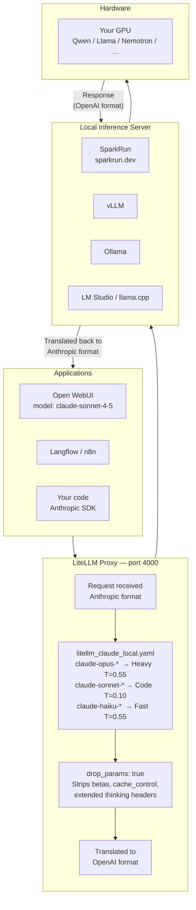
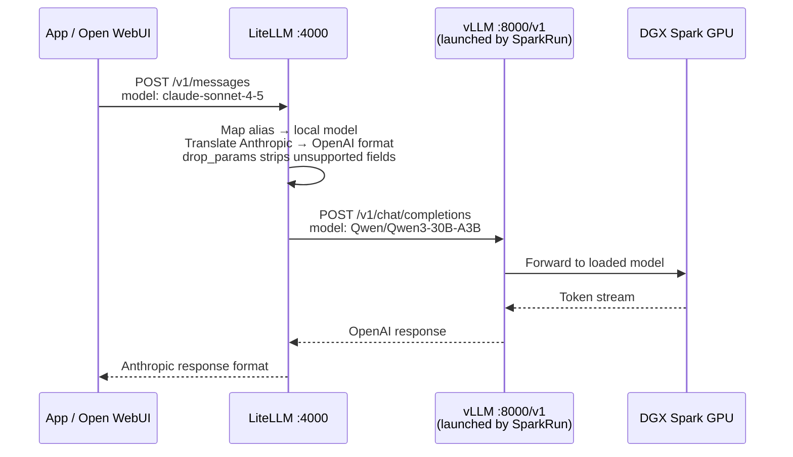

# claude-local-stack

Route any Anthropic-SDK application — **Open WebUI, Langflow, n8n, your own code** — to a local model server by mapping `claude-*` model names through a [LiteLLM](https://github.com/BerriAI/litellm) proxy.

Your local model (vLLM, Ollama, LM Studio, llama.cpp, NVIDIA NIM, **[SparkRun](https://sparkrun.dev)**…) answers every request that asks for `claude-sonnet-4-5`, `claude-opus-4-5`, `claude-haiku-3-5`, and all versioned aliases — without changing a single line of application code.

---

## Contents

- [How it works](#how-it-works)
- [Quick start](#quick-start)
- [Using with SparkRun](#using-with-sparkrun)
- [Configuration](#configuration)
- [Model routing & temperature guide](#model-routing--temperature-guide)
- [⚠️ The Claude Code CLI conflict](#️-the-claude-code-cli-conflict)
- [Using with Open WebUI](#using-with-open-webui)
- [Using with Langflow](#using-with-langflow)
- [Using with your own code](#using-with-your-own-code)
- [Reference](#reference)

---

## How it works



LiteLLM acts as a **translation layer**. It receives requests in Anthropic format, rewrites them to OpenAI format (which every local server understands), and forwards them. Responses are translated back before being returned. The calling application never knows a local model answered.

`drop_params: true` in the config silently strips parameters that only Anthropic supports (`betas`, `cache_control`, extended thinking headers, etc.) so they don't cause errors on the local endpoint.

---

## Quick start

**1. Clone and configure**

```bash
git clone https://github.com/MARKYMARK55/claude-local-stack.git
cd claude-local-stack
```

Edit `litellm_claude_local.yaml` — find every `your-model-name` and `your-api-key` and replace them:

```yaml
# Example for vLLM or SparkRun (default port 8000)
model: openai/Qwen/Qwen2.5-Coder-32B-Instruct
api_base: http://host.docker.internal:8000/v1
api_key: your-api-key          # or "EMPTY" if no auth configured

# Example for Ollama
model: openai/qwen2.5-coder:32b
api_base: http://host.docker.internal:11434/v1
api_key: ollama
```

**2. Start the proxy**

```bash
docker compose up -d
```

**3. Verify**

```bash
curl http://localhost:4000/v1/models \
  -H "Authorization: Bearer simple-api-key" | python3 -m json.tool
```

You should see all 11 `claude-*` model names listed.

**4. Point your app at the proxy**

| Setting | Value |
|---|---|
| API base URL | `http://localhost:4000/v1` |
| API key | `simple-api-key` (or whatever you set as `LITELLM_MASTER_KEY`) |

---

## Using with SparkRun

[SparkRun](https://sparkrun.dev) is a CLI tool for launching and managing LLM inference workloads on NVIDIA DGX Spark systems. It eliminates the need for Slurm or Kubernetes — pick a recipe, run it, and SparkRun handles container orchestration, model distribution, and networking automatically. It supports vLLM, SGLang, llama.cpp, and eugr-vllm runtimes.

Once a recipe is running, vLLM exposes an OpenAI-compatible API endpoint that LiteLLM connects to.



### Step 1 — Install SparkRun and launch a model

```bash
# Install SparkRun
uvx sparkrun setup install

# Launch a model recipe (vLLM exposes it on port 8000 by default)
sparkrun run qwen3-30b-vllm

# Or with a custom port
sparkrun run qwen3-30b-vllm --port 9000

# Check status
sparkrun status
```

See [sparkrun.dev](https://sparkrun.dev) for the full recipe catalogue, multi-node `--tp` flag usage, and cluster configuration.

### Step 2 — Find the model ID vLLM is serving

```bash
# Query the vLLM models endpoint directly
curl http://localhost:8000/v1/models | python3 -m json.tool
# Look for: "id": "Qwen/Qwen3-30B-A3B"
```

### Step 3 — Set the model ID in the config

Update `litellm_claude_local.yaml` — replace `your-model-name` with the exact ID returned above:

```yaml
litellm_params:
  model: openai/Qwen/Qwen3-30B-A3B
  api_base: http://host.docker.internal:8000/v1
  api_key: EMPTY
```

Then restart the proxy to pick up the change:

```bash
docker compose restart
```

### Step 4 — Register aliases dynamically (no restart needed)

LiteLLM also supports live model registration via API — useful when SparkRun switches models without restarting the whole proxy:

```bash
curl -X POST http://localhost:4000/model/new \
  -H "Authorization: Bearer simple-api-key" \
  -H "Content-Type: application/json" \
  -d '{
    "model_name": "claude-sonnet-4-5",
    "litellm_params": {
      "model": "openai/Qwen/Qwen3-30B-A3B",
      "api_base": "http://host.docker.internal:8000/v1",
      "api_key": "EMPTY",
      "temperature": 0.10,
      "max_tokens": 16384,
      "timeout": 300
    }
  }'
```

### Step 5 — Verify end-to-end

```bash
curl http://localhost:4000/v1/messages \
  -H "Authorization: Bearer simple-api-key" \
  -H "Content-Type: application/json" \
  -d '{
    "model": "claude-sonnet-4-5",
    "max_tokens": 64,
    "messages": [{"role": "user", "content": "Reply with only: LOCAL MODEL WORKING"}]
  }'
```

---

## Configuration

### Changing the master key

Replace `simple-api-key` in `docker-compose.yml`:

```yaml
environment:
  LITELLM_MASTER_KEY: "my-secret-key"
```

Use the same value in every app that connects.

### Pointing at a different local server

Every model entry in `litellm_claude_local.yaml` has two fields to change:

```yaml
litellm_params:
  model: openai/<model-id-your-server-uses>
  api_base: http://host.docker.internal:<port>/v1
  api_key: <your-server-key-or-EMPTY>
```

`host.docker.internal` resolves to the host machine from inside Docker on both macOS and Linux (the compose file adds the required `extra_hosts` entry for Linux automatically).

### Running on a remote server

Change `api_base` to the full network address of your inference server:

```yaml
api_base: http://192.168.1.50:8000/v1
```

### Adding models that aren't aliased

Add any new entry directly to `model_list` in `litellm_claude_local.yaml`. No restart needed if you use the [LiteLLM UI](https://docs.litellm.ai/docs/proxy/ui) or the `/model/new` API to add them at runtime.

---

## Model routing & temperature guide

The config maps three tiers of Claude model name to the same local model with different temperature and timeout settings. Adjust these to match your model's strengths.

| Alias group | Model names | Temp | Max tokens | Use for |
|---|---|---|---|---|
| **Opus** | `claude-opus-4-5`, `claude-opus-4-0`, `claude-3-7-sonnet-20250219`, `claude-3-opus-20240229` | 0.55 | 32 768 | Deep reasoning, long-horizon planning, complex analysis |
| **Sonnet** | `claude-sonnet-4-5`, `claude-sonnet-4-0`, `claude-3-5-sonnet-20241022`, `claude-3-5-sonnet-20240620` | **0.10** | 16 384 | Code generation — low temperature gives deterministic, reproducible output |
| **Haiku** | `claude-haiku-3-5`, `claude-3-5-haiku-20241022`, `claude-3-haiku-20240307` | 0.55 | 16 384 | Fast summarisation, classification, cheap sub-tasks |

**Why different temperatures for the same underlying model?**

Applications choose the model tier that matches the task. Sonnet is most commonly used for coding tasks, where low temperature is critical — it eliminates hallucinated function names, inconsistent variable usage, and non-reproducible outputs. Opus is chosen for reasoning tasks where creative exploration is more valuable than strict determinism.

---

## ⚠️ The Claude Code CLI conflict

This section is important if you use [Claude Code](https://code.claude.com) (the terminal coding assistant) **as a CLI tool on the same machine**.

### What causes the conflict

Claude Code CLI respects two environment variables:

```bash
ANTHROPIC_BASE_URL   # where to send API requests
ANTHROPIC_AUTH_TOKEN # API key to use
```

If these are set in your shell — and LiteLLM has `claude-*` model aliases registered — **every Claude Code request silently routes to your local model instead of Anthropic's API**. You get your local model answering as if it were Claude Sonnet. The CLI gives no warning.

See the official Anthropic documentation: [LLM Gateway — Claude Code](https://code.claude.com/docs/en/llm-gateway).

### Who is affected

| Surface | Affected? | Why |
|---|---|---|
| **Claude Code CLI** (`claude` in terminal) | ✅ Yes — if `ANTHROPIC_BASE_URL` is set | CLI reads env vars at startup |
| **Claude Desktop app** | ❌ No | Connects directly to `api.anthropic.com`, ignores shell env vars |
| **Claude web app** | ❌ No | Browser-based, no access to shell env |
| **Open WebUI** | ❌ No | Connects to LiteLLM via its own settings, not shell env |
| **Your own code using Anthropic SDK** | ✅ Yes — if `ANTHROPIC_BASE_URL` is set | SDK reads env vars |

### The safe patterns

**Pattern 1 — Don't set `ANTHROPIC_BASE_URL` globally (recommended)**

Keep your shell clean. Only set the env vars when you deliberately want local routing:

```bash
# One-off local session
ANTHROPIC_BASE_URL=http://localhost:4000 \
ANTHROPIC_AUTH_TOKEN=simple-api-key \
claude

# Back to Anthropic cloud — just open a new terminal or:
unset ANTHROPIC_BASE_URL
```

**Pattern 2 — Named alias for intentional local use**

```bash
# Add to ~/.bashrc or ~/.zshrc
alias claude-local='ANTHROPIC_BASE_URL=http://localhost:4000 ANTHROPIC_AUTH_TOKEN=simple-api-key claude'
```

```bash
claude          # → Anthropic cloud (real Claude)
claude-local    # → local model via LiteLLM (explicit, intentional)
```

**Pattern 3 — Separate port for Claude Code CLI**

Run a second LiteLLM instance on a different port (e.g. 4003) and only ever point `ANTHROPIC_BASE_URL` at that one. The main port 4000 stays clean for Open WebUI and other tools.

### What happens if you do route Claude Code CLI locally

The CLI will work but with reduced capability. Local models (even strong ones) differ from Claude in:

- **Tool use reliability** — function calling schemas may not be followed as strictly
- **Context window** — most local models are 32K–128K vs Claude's 200K
- **Extended thinking** — Claude's `thinking` parameter is stripped by `drop_params: true`
- **Instruction following** — system prompt fidelity varies by model

For agentic coding tasks with file edits, bash commands, and multi-step plans, Claude Sonnet/Opus outperforms current open-weight models. Local routing is best suited for quick questions, summarisation, and experimentation.

---

## Using with Open WebUI

1. Start this stack: `docker compose up -d`
2. Open WebUI → **Admin → Settings → Connections → Add Connection**
3. Fill in:
   - **Name:** Local Models
   - **URL:** `http://localhost:4000/v1`
   - **Key:** `simple-api-key`
4. Save — all `claude-*` model names appear in the model selector immediately.

If Open WebUI is running in Docker on the same `llm-net` network, use `http://litellm-claude-local:4000/v1` instead of `localhost`.

---

## Using with Langflow

In any Langflow component that has an OpenAI-compatible endpoint field:

- **Base URL:** `http://localhost:4000/v1`
- **API Key:** `simple-api-key`
- **Model:** `claude-sonnet-4-5` (or any alias)

---

## Using with your own code

**Python (Anthropic SDK)**

```python
import anthropic

client = anthropic.Anthropic(
    base_url="http://localhost:4000",
    api_key="simple-api-key",
)

message = client.messages.create(
    model="claude-sonnet-4-5",   # routed to your local model
    max_tokens=1024,
    messages=[{"role": "user", "content": "Explain transformers in one paragraph."}],
)
print(message.content[0].text)
```

**Python (OpenAI SDK — also works)**

```python
from openai import OpenAI

client = OpenAI(
    base_url="http://localhost:4000/v1",
    api_key="simple-api-key",
)

response = client.chat.completions.create(
    model="claude-sonnet-4-5",
    messages=[{"role": "user", "content": "Write a binary search in Python."}],
)
print(response.choices[0].message.content)
```

**Environment variables (any SDK)**

```bash
export OPENAI_API_BASE="http://localhost:4000/v1"
export OPENAI_API_KEY="simple-api-key"
# or for Anthropic SDK:
export ANTHROPIC_BASE_URL="http://localhost:4000"
export ANTHROPIC_AUTH_TOKEN="simple-api-key"
```

---

## Reference

### Anthropic (official)

| Resource | Link |
|---|---|
| LLM Gateway — Claude Code | https://code.claude.com/docs/en/llm-gateway |
| Third-party integrations | https://code.claude.com/docs/en/third-party-integrations |
| Python SDK — base_url | https://platform.claude.com/docs/en/api/sdks/python |

### LiteLLM

| Resource | Link |
|---|---|
| GitHub | https://github.com/BerriAI/litellm |
| Docs home | https://docs.litellm.ai |
| Proxy quickstart | https://docs.litellm.ai/docs/proxy/quick_start |
| Supported providers | https://docs.litellm.ai/docs/providers |
| Claude Code tutorial | https://docs.litellm.ai/docs/tutorials/claude_non_anthropic_models |
| MCP tutorial | https://docs.litellm.ai/docs/tutorials/claude_mcp |
| Config reference | https://docs.litellm.ai/docs/proxy/configs |
| drop_params | https://docs.litellm.ai/docs/completion/drop_params |
| Routing | https://docs.litellm.ai/docs/routing |
| Docker image | `ghcr.io/berriai/litellm:main-latest` |

### SparkRun

| Resource | Link |
|---|---|
| Website & docs | https://sparkrun.dev |
| GitHub | https://github.com/scitrera/sparkrun |

---

## Licence

MIT
