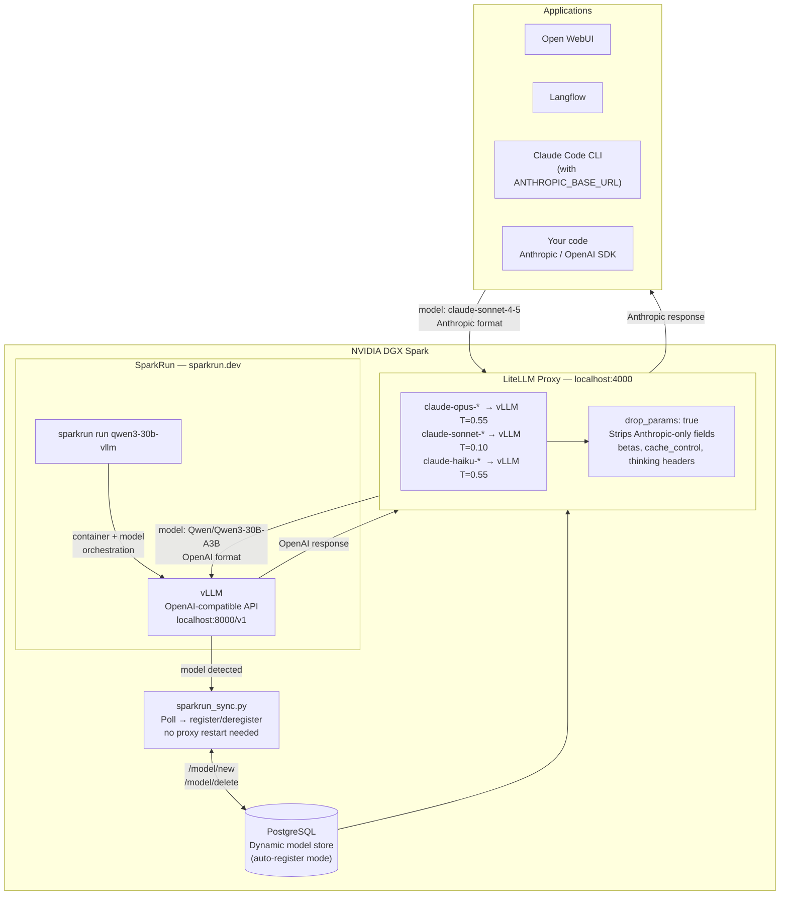
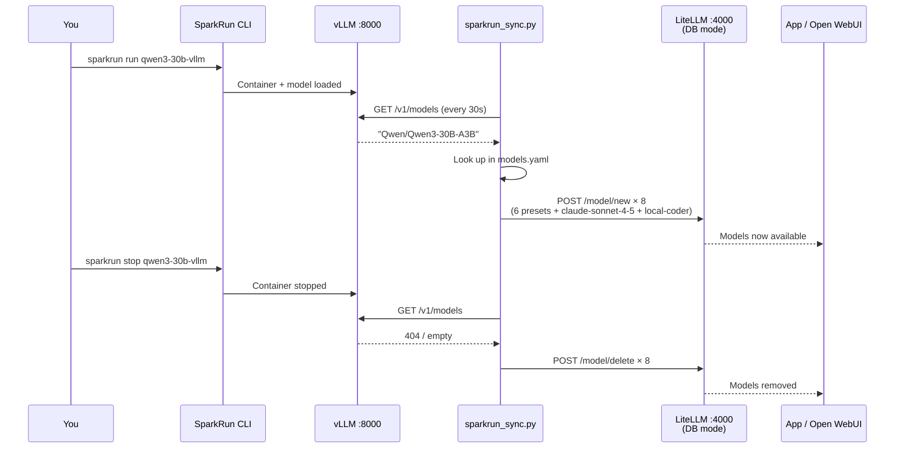
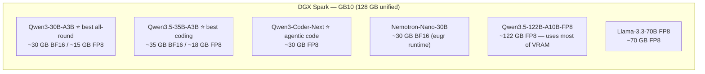

# SparkRun Auto Model Registration with LiteLLM & Local Claude Code Setup

Route applications using the Anthropic SDK — **Open WebUI, Langflow, Claude Code CLI** — to models running on your **NVIDIA DGX Spark** via [SparkRun](https://sparkrun.dev) and [vLLM](https://github.com/vllm-project/vllm), by mapping `claude-*` model names through a [LiteLLM](https://github.com/BerriAI/litellm) proxy.

SparkRun launches a model onto the DGX Spark GPU. vLLM serves it on an OpenAI-compatible API. LiteLLM sits in front and answers any request for `claude-sonnet-4-5`, `claude-opus-4-5`, `claude-haiku-3-5`, and all versioned aliases — without changing application code.

---

## Contents

- [How it works](#how-it-works)
- [Prerequisites](#prerequisites)
- [Quick start — static config](#quick-start--static-config)
- [Auto-registration — sparkrun_sync.py](#auto-registration--sparkrun_syncpy)
- [Model routing & temperature guide](#model-routing--temperature-guide)
- [⚠️ The Claude Code CLI conflict](#️-the-claude-code-cli-conflict)
- [Using with Open WebUI](#using-with-open-webui)
- [Using with Langflow](#using-with-langflow)
- [Using with your own code](#using-with-your-own-code)
- [Reference](#reference)

---

## How it works



**LiteLLM** translates between Anthropic format (what apps send) and OpenAI format (what vLLM expects). `drop_params: true` silently strips Anthropic-only parameters — `betas`, `cache_control`, extended thinking headers — that would cause errors on the vLLM endpoint.

**sparkrun_sync.py** watches vLLM on port 8000. When SparkRun loads a new model it registers presets and claude aliases into the LiteLLM database automatically. When the model is unloaded it cleans them up.

---

## Prerequisites

- NVIDIA DGX Spark with GPU access
- [SparkRun](https://sparkrun.dev) installed: `uvx sparkrun setup install`
- Docker (for LiteLLM proxy)
- Python 3.11+ (for sparkrun_sync.py)

---

## Quick start — static config

Use this when you run one model at a time and don't mind restarting the proxy when it changes.

**1. Clone**

```bash
git clone https://github.com/MARKYMARK55/sparkrun-litellm-local.git
cd sparkrun-litellm-local
```

**2. Launch a model with SparkRun**

```bash
sparkrun run qwen3-30b-vllm
sparkrun status
```

**3. Find the exact model ID vLLM is serving**

```bash
curl http://localhost:8000/v1/models | python3 -m json.tool
# Note the "id" field — e.g. "Qwen/Qwen3-30B-A3B"
```

**4. Set the model ID in the config**

Edit `litellm_claude_local.yaml` — replace `your-model-name` in every entry:

```yaml
litellm_params:
  model: openai/Qwen/Qwen3-30B-A3B   # ← exact id from step 3
  api_base: http://host.docker.internal:8000/v1
  api_key: EMPTY
```

**5. Start the proxy**

```bash
docker compose up -d
```

**6. Check container status**

```bash
docker ps --filter name=litellm
docker logs litellm-claude-local -f
```

**7. Verify**

```bash
# Check aliases are registered
curl http://localhost:4000/v1/models \
  -H "Authorization: Bearer simple-api-key" | python3 -m json.tool

# End-to-end test
curl http://localhost:4000/v1/messages \
  -H "Authorization: Bearer simple-api-key" \
  -H "Content-Type: application/json" \
  -d '{
    "model": "claude-sonnet-4-5",
    "max_tokens": 32,
    "messages": [{"role": "user", "content": "Reply: DGX SPARK WORKING"}]
  }'
```

**Point your apps at the proxy**

| Setting | Value |
|---|---|
| Base URL | `http://localhost:4000/v1` |
| API key | `simple-api-key` |

---

## Auto-registration — sparkrun_sync.py

When SparkRun swaps models on the DGX Spark, the static config goes stale. **`sparkrun_sync.py`** watches vLLM, detects model changes, and registers/deregisters presets and claude aliases in the LiteLLM database — no proxy restart needed.



### Thinking style translation

SparkRun runs different model families, each exposing extended thinking via a different vLLM parameter. `sparkrun_sync.py` reads `thinking_style` from `models.yaml` and translates a single `thinking: N` budget into the correct format automatically:

| `thinking_style` | Model families | What gets sent to vLLM |
|---|---|---|
| `thinking_budget` | Qwen3, Qwen3.5, MiniMax, DeepSeek-R1 | `thinking_budget: N` (top-level) |
| `nemotron` | NVIDIA Nemotron-Nano, Nemotron-Super | `extra_body.chat_template_kwargs.enable_thinking: true, thinking_budget: N` |
| `effort` | GPT-OSS | `extra_body.chat_template_kwargs.effort: "medium"|"high"|"max"` |
| `none` | GLM, small Qwen, Llama | No thinking params |

### Setup

**1. Start LiteLLM with Postgres (DB mode)**

```bash
docker compose -f auto-register/docker-compose.db.yml up -d
```

Container names in DB mode:

| Container | Purpose |
|---|---|
| `litellm-claude-local` | LiteLLM proxy on port 4000 |
| `litellm-db` | PostgreSQL model store |

```bash
docker ps --filter name=litellm
docker logs litellm-claude-local -f
docker logs litellm-db -f
```

**2. Configure models**

Edit `auto-register/models.yaml`. Add an entry for each model SparkRun may load:

```yaml
"Qwen/Qwen3-30B-A3B":
  short_name: "Qwen3-30B"            # prefix: Qwen3-30B-Fast, Qwen3-30B-Code, etc.
  thinking_style: "thinking_budget"
  claude_code_alias: "claude-sonnet-4-5"   # also registers this alias
```

Find the exact model name with:

```bash
curl http://localhost:8000/v1/models | python3 -m json.tool
```

**3. Install and run the sync daemon**

```bash
pip install requests pyyaml

# Test: single pass
python auto-register/sparkrun_sync.py --once

# Production: continuous watch
python auto-register/sparkrun_sync.py --watch
```

**4. Load a model — presets appear automatically**

```bash
sparkrun run qwen3-30b-vllm
```

```
10:42:01 [INFO] Port 8000: detected Qwen/Qwen3-30B-A3B
10:42:01 [INFO]   Config match: Qwen3-30B
10:42:01 [INFO]   + Qwen3-30B-Fast          id: 3a7f1c...
10:42:01 [INFO]   + Qwen3-30B-Expert        id: 9b2e4d...
10:42:01 [INFO]   + Qwen3-30B-Heavy         id: 5c8a0f...
10:42:01 [INFO]   + Qwen3-30B-Max           id: 1d6b3e...
10:42:01 [INFO]   + Qwen3-30B-Code          id: 7f4c2a...
10:42:01 [INFO]   + Qwen3-30B-Creative      id: 2e9d5b...
10:42:01 [INFO]   + claude-sonnet-4-5       id: 8a1f7c...
10:42:01 [INFO]   + local-coder             id: 4b6e3d...
```

**5. Swap models — zero downtime**

```bash
sparkrun stop qwen3-30b-vllm
sparkrun run qwen3-coder-next-vllm
# sync detects the change, deregisters old presets, registers new ones
```

### CLI reference

```bash
python sparkrun_sync.py --once                   # single pass then exit
python sparkrun_sync.py --watch                  # continuous (default 30s)
python sparkrun_sync.py --watch --interval 15    # custom poll interval
python sparkrun_sync.py --deregister-all         # remove all dynamic models
python sparkrun_sync.py --once --port 8001       # target one endpoint
python sparkrun_sync.py --litellm-url http://192.168.1.10:4000
python sparkrun_sync.py -v                       # verbose / debug logging
```

### Run as a systemd service

```ini
# ~/.config/systemd/user/sparkrun-sync.service
[Unit]
Description=SparkRun → LiteLLM model sync
After=network.target

[Service]
ExecStart=/usr/bin/python3 /path/to/sparkrun-litellm-local/auto-register/sparkrun_sync.py --watch --interval 30
Restart=on-failure
RestartSec=10

[Install]
WantedBy=default.target
```

```bash
systemctl --user enable --now sparkrun-sync
journalctl --user -fu sparkrun-sync
```

---

## Recommended models for DGX Spark

The NVIDIA DGX Spark has a **GB10 Grace Blackwell Superchip** — **1 GPU, 128 GB of LPDDR5x unified memory** at 273 GB/s. All memory is coherent between CPU and GPU, so the full 128 GB is available for model weights.



### Recommended picks

| Model | SparkRun recipe | Thinking style | Best for | claude alias |
|---|---|---|---|---|
| **Qwen3.5-35B-A3B** | `qwen35-35b-vllm` | `thinking_budget` | Coding, instruction following | `claude-sonnet-4-5` |
| **Qwen3-30B-A3B** | `qwen3-30b-vllm` | `thinking_budget` | All-round, fast thinking | `claude-sonnet-4-5` |
| **Qwen3-Coder-Next** | `qwen3-coder-vllm` | `thinking_budget` | Pure code generation, agentic tasks | `claude-sonnet-4-5` |
| **Nemotron-Nano-30B** | `nemotron-nano-vllm` | `nemotron` | DGX-optimised, synthesis tasks | `claude-sonnet-4-5` |
| **Qwen3.5-122B-A10B-FP8** | `qwen35-122b-vllm` | `thinking_budget` | Complex reasoning, long context | `claude-opus-4-5` |
| **Llama-3.3-70B-Instruct** | `llama33-70b-vllm` | `none` | Fast, no thinking overhead | `claude-sonnet-4-5` |

### Notes

- **128 GB unified memory** means the GB10 shares one pool between CPU and GPU — no separate VRAM budget to worry about
- **MoE models** (Qwen3-30B-A3B: 30B params / 3B active) give 70B-class quality at 30B inference cost and load very fast
- **FP8 variants** (suffix `-FP8`) are strongly preferred on Blackwell — native hardware support, ~half the memory footprint, minimal quality loss
- **Qwen3.5-122B-A10B-FP8** at ~122 GB is close to the 128 GB limit — leaves little headroom; load nothing else alongside it
- **Dense 70B BF16** (~140 GB) does **not** fit — use FP8 quantised variant (~70 GB) instead
- **eugr runtime** (NVIDIA-optimised vLLM fork) gives 10–20% more throughput on Blackwell for Nemotron models — specify in the SparkRun recipe if available
- All models above have entries in `auto-register/models.yaml` with the correct thinking style pre-configured

### Swap models on the fly

```bash
# Start with a fast all-round model
sparkrun run qwen3-30b-vllm

# Switch to the coding specialist for a coding session
sparkrun stop qwen3-30b-vllm
sparkrun run qwen3-coder-next-vllm

# sparkrun_sync.py detects the change within 30s and updates LiteLLM automatically
```

---

## Model routing & temperature guide

Both modes map three tiers of Claude model name to the active vLLM model with tuned settings per tier:

| Alias tier | Claude model names | Temp | Max tokens | Use for |
|---|---|---|---|---|
| **Opus** | `claude-opus-4-5`, `claude-opus-4-0`, `claude-3-7-sonnet-20250219`, `claude-3-opus-20240229` | 0.55 | 32 768 | Deep reasoning, long-horizon tasks, complex analysis |
| **Sonnet** | `claude-sonnet-4-5`, `claude-sonnet-4-0`, `claude-3-5-sonnet-20241022`, `claude-3-5-sonnet-20240620` | **0.10** | 16 384 | Code generation — low temp = deterministic, reproducible output |
| **Haiku** | `claude-haiku-3-5`, `claude-3-5-haiku-20241022`, `claude-3-haiku-20240307` | 0.55 | 16 384 | Fast responses, summarisation, cheap sub-tasks |

Low temperature on Sonnet is deliberate — it eliminates hallucinated function names, inconsistent variable usage, and non-reproducible outputs when used for coding tasks.

---

## ⚠️ The Claude Code CLI conflict

This matters if you run [Claude Code](https://code.claude.com) as a **CLI tool on the DGX Spark itself**.

### What causes it

Claude Code CLI reads two environment variables at startup:

```bash
ANTHROPIC_BASE_URL   # where to send requests
ANTHROPIC_AUTH_TOKEN # API key
```

If these point at the LiteLLM proxy — and LiteLLM has `claude-*` aliases registered — every Claude Code request silently routes to your local vLLM model instead of Anthropic's API. No warning is shown.

See the official Anthropic docs: [LLM Gateway — Claude Code](https://code.claude.com/docs/en/llm-gateway).

### Who is affected

| Surface | Affected? | Reason |
|---|---|---|
| **Claude Code CLI** (`claude` in terminal) | ✅ Yes — if `ANTHROPIC_BASE_URL` is set | CLI reads env vars at startup |
| **Claude Desktop app** | ❌ No | Connects directly to `api.anthropic.com` — ignores shell env |
| **Claude web app** | ❌ No | Browser-based, no shell env access |
| **Open WebUI** | ❌ No | Uses its own connection settings, not shell env |
| **Your own code (Anthropic SDK)** | ✅ Yes — if `ANTHROPIC_BASE_URL` is set | SDK reads env vars |

### Safe patterns

**One-off local session**

```bash
ANTHROPIC_BASE_URL=http://localhost:4000 \
ANTHROPIC_AUTH_TOKEN=simple-api-key \
claude
# New terminal = back to Anthropic cloud
```

**Named alias (add to `~/.bashrc`)**

```bash
alias claude-local='ANTHROPIC_BASE_URL=http://localhost:4000 ANTHROPIC_AUTH_TOKEN=simple-api-key claude'
```

```bash
claude          # → Anthropic cloud
claude-local    # → DGX Spark vLLM via LiteLLM
```

---

## Using with Open WebUI

1. Start the proxy: `docker compose up -d`
2. Open WebUI → **Admin → Settings → Connections → Add Connection**
3. Set **URL** to `http://localhost:4000/v1` and **Key** to `simple-api-key`
4. All `claude-*` model names appear in the model selector immediately

If Open WebUI runs in Docker on the same network, use the container name instead of `localhost`.

---

## Using with Langflow

In any Langflow component with an OpenAI-compatible endpoint:

- **Base URL:** `http://localhost:4000/v1`
- **API Key:** `simple-api-key`
- **Model:** `claude-sonnet-4-5`

---

## Using with your own code

**Anthropic SDK**

```python
import anthropic

client = anthropic.Anthropic(
    base_url="http://localhost:4000",
    api_key="simple-api-key",
)
msg = client.messages.create(
    model="claude-sonnet-4-5",   # → DGX Spark vLLM
    max_tokens=1024,
    messages=[{"role": "user", "content": "Hello from DGX Spark"}],
)
print(msg.content[0].text)
```

**OpenAI SDK**

```python
from openai import OpenAI

client = OpenAI(base_url="http://localhost:4000/v1", api_key="simple-api-key")
resp = client.chat.completions.create(
    model="claude-sonnet-4-5",
    messages=[{"role": "user", "content": "Hello from DGX Spark"}],
)
print(resp.choices[0].message.content)
```

**Environment variables**

```bash
export ANTHROPIC_BASE_URL="http://localhost:4000"
export ANTHROPIC_AUTH_TOKEN="simple-api-key"
```

---

## Reference

### Anthropic (official)

| Resource | Link |
|---|---|
| LLM Gateway — Claude Code | https://code.claude.com/docs/en/llm-gateway |
| Third-party integrations | https://code.claude.com/docs/en/third-party-integrations |
| Python SDK — base_url | https://platform.claude.com/docs/en/api/sdks/python |

### LiteLLM

| Resource | Link |
|---|---|
| GitHub | https://github.com/BerriAI/litellm |
| Docs | https://docs.litellm.ai |
| Proxy quickstart | https://docs.litellm.ai/docs/proxy/quick_start |
| Claude Code tutorial | https://docs.litellm.ai/docs/tutorials/claude_non_anthropic_models |
| Config reference | https://docs.litellm.ai/docs/proxy/configs |
| drop_params | https://docs.litellm.ai/docs/completion/drop_params |
| Docker image | `ghcr.io/berriai/litellm:main-latest` |

### SparkRun

| Resource | Link |
|---|---|
| Website & docs | https://sparkrun.dev |
| GitHub | https://github.com/scitrera/sparkrun |

---

## Licence

MIT
